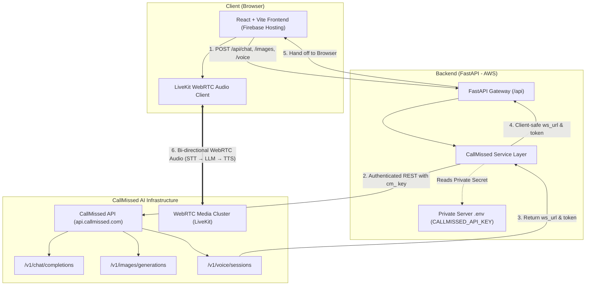

# CallMissed Voice Agent Platform

A modern web application built with **React + Vite** and **FastAPI** that enables real-time conversational voice agents over WebRTC, AI chat completion, and text-to-image generation powered by the [CallMissed API](https://docs.callmissed.com/).

---

## 🏛 Architecture Overview



---

## 🔐 Security & Privacy Architecture

- **Private API Key**: The CallMissed API key (`cm_...`) is strictly stored and used server-side in the FastAPI backend environment. It is **never** embedded, bundled, or transmitted to the React frontend.
- **Client-Safe Session Tokens**: The `/api/voice/session` endpoint creates the voice session upstream on CallMissed and returns only the ephemeral WebRTC media URL (`ws_url`) and connection JWT token to the browser client.
- **Strict Input Validation**: Pydantic models validate all incoming payloads (prompts, model names, bounds, roles) before invoking upstream endpoints.
- **CORS Protection**: CORS middleware restricts API access to authorized frontend domains.

---

## ✨ Features

### 1. 🎙️ WebRTC Voice Agent
- Real-time conversational voice agent over low-latency WebRTC using `livekit-client`.
- Audio streaming pipeline: **Speech-to-Text (STT) → LLM Reasoning → Text-to-Speech (TTS)**.
- Spoken agent greeting and server-side Voice Activity Detection (VAD) with automatic interruption handling.
- Real-time live transcript feed with speech bubbles and speaker attribution (`You` vs `Agent`).
- Interactive audio waveform visualizer and microphone mute/unmute toggle.
- Transcript export to JSON.
- Configurable language (`en-IN`, `hi-IN`, `ta-IN`, `te-IN`, `bn-IN`, `mr-IN`), voice ID (`shubh`, `maya`, `arjun`), and LLM models (`kimi-k2.5`, `sarvam-105b`).

### 2. 💬 AI Chat
- Multi-turn conversation with OpenAI-compatible endpoint (`/v1/chat/completions`).
- Supports Indian languages and high-context models (`sarvam-105b`, `kimi-k2.5`, `gpt-5.6-luna`).
- Configurable system prompts and quick-start starter prompt chips.
- Message copy actions and token usage metrics.

### 3. 🎨 Image Studio
- Text-to-image generation (`/v1/images/generations`) with models such as `flux-2-klein-9b`, `sdxl-lightning`, `lucid-origin`, `phoenix-1.0`, and `flux-2-dev`.
- Multiple aspect ratio presets: `1024x1024`, `768x768`, and `512x512`.
- Negative prompts and custom seed control.
- Interactive image gallery with full-screen zoom lightbox and direct PNG download.

---

## 📁 Project Structure

```
callmissed/
├── .gitignore
├── README.md
├── docker-compose.yml
├── firebase.json
├── .firebaserc
├── callmissed_project_architecture.json
│
├── backend/
│   ├── Dockerfile
│   ├── requirements.txt
│   ├── .env.example
│   ├── .env
│   ├── app/
│   │   ├── __init__.py
│   │   ├── config.py
│   │   ├── main.py
│   │   ├── schemas/
│   │   │   ├── __init__.py
│   │   │   ├── chat.py
│   │   │   ├── images.py
│   │   │   └── voice.py
│   │   ├── services/
│   │   │   ├── __init__.py
│   │   │   └── callmissed.py
│   │   └── api/
│   │       ├── __init__.py
│   │       ├── api_router.py
│   │       └── routes/
│   │           ├── __init__.py
│   │           ├── chat.py
│   │           ├── images.py
│   │           ├── voice.py
│   │           └── health.py
│   └── tests/
│       ├── __init__.py
│       ├── test_health.py
│       ├── test_chat.py
│       ├── test_images.py
│       └── test_voice.py
│
└── frontend/
    ├── package.json
    ├── vite.config.js
    ├── index.html
    ├── .env.example
    ├── .env
    └── src/
        ├── main.jsx
        ├── App.jsx
        ├── index.css
        ├── services/
        │   └── api.js
        └── components/
            ├── Header.jsx
            ├── Chat/
            │   └── ChatContainer.jsx
            ├── ImageGenerator/
            │   └── ImageGeneratorContainer.jsx
            └── VoiceAgent/
                ├── VoiceAgentContainer.jsx
                ├── VoiceVisualizer.jsx
                └── LiveTranscript.jsx
```

---

## 🚀 Quickstart & Local Setup

### Prerequisites
- **Python**: 3.10+ (tested on Python 3.13)
- **Node.js**: 18+ (tested on Node v24)
- **CallMissed API Key**: Obtain a `cm_...` API key from [CallMissed Console](https://console.callmissed.com/developer/keys)

---

### Step 1: Run Backend (FastAPI)

1. Open a terminal in `backend/`:
   ```bash
   cd backend
   ```

2. Create and activate a virtual environment:
   ```bash
   # Windows PowerShell
   python -m venv venv
   .\venv\Scripts\Activate.ps1

   # Linux / macOS
   python3 -m venv venv
   source venv/bin/activate
   ```

3. Install dependencies:
   ```bash
   pip install -r requirements.txt
   ```

4. Configure environment variables in `backend/.env`:
   ```env
   CALLMISSED_API_KEY=cm_your_api_key_here
   CALLMISSED_BASE_URL=https://api.callmissed.com
   ENVIRONMENT=development
   ALLOWED_ORIGINS=http://localhost:5173,http://localhost:3000
   CALLMISSED_MOCK_MODE=false
   ```
   *(Note: If `CALLMISSED_API_KEY` is empty, the backend automatically runs in Mock Mode for testing without incurring credit usage).*

5. Start the FastAPI server:
   ```bash
   uvicorn app.main:app --host 0.0.0.0 --port 8000 --reload
   ```

   - Swagger Interactive API Docs: [http://localhost:8000/docs](http://localhost:8000/docs)
   - Health check: [http://localhost:8000/api/health](http://localhost:8000/api/health)

---

### Step 2: Run Frontend (React + Vite)

1. Open a second terminal in `frontend/`:
   ```bash
   cd frontend
   ```

2. Install dependencies:
   ```bash
   npm install
   ```

3. Verify `frontend/.env`:
   ```env
   VITE_API_BASE_URL=http://localhost:8000
   ```

4. Start the Vite development server:
   ```bash
   npm run dev
   ```

5. Open your browser at [http://localhost:5173](http://localhost:5173).

---

## 🧪 Testing

The backend includes a comprehensive pytest suite covering request validation, CallMissed service error handling, security invariants, and all endpoints.

Run the test suite:
```bash
cd backend
pytest tests -v
```

Output:
```
tests/test_chat.py::test_chat_success PASSED
tests/test_chat.py::test_chat_empty_messages_validation PASSED
tests/test_chat.py::test_chat_invalid_role PASSED
tests/test_chat.py::test_chat_api_error_propagation PASSED
tests/test_health.py::test_root_endpoint PASSED
tests/test_health.py::test_health_check_endpoint PASSED
tests/test_images.py::test_image_generation_success PASSED
tests/test_images.py::test_image_generation_empty_prompt PASSED
tests/test_images.py::test_image_generation_invalid_count PASSED
tests/test_images.py::test_image_generation_error_propagation PASSED
tests/test_voice.py::test_create_voice_session PASSED
tests/test_voice.py::test_get_voice_transcript PASSED
tests/test_voice.py::test_delete_voice_session PASSED

13 passed in 0.49s
```

---

## 📡 API Endpoints Reference

| Method | Endpoint | Description |
|---|---|---|
| `POST` | `/api/chat` | Send messages to CallMissed Chat Completion API |
| `POST` | `/api/images/generate` | Generate images from text prompts |
| `POST` | `/api/voice/session` | Create WebRTC voice session & mint client connection JWT |
| `GET` | `/api/voice/session/{id}/transcript` | Fetch turn-by-turn session transcript (`json`, `txt`, `srt`) |
| `DELETE` | `/api/voice/session/{id}` | Terminate active voice session |
| `GET` | `/api/health` | Health and connectivity check |

---

## 🚢 Deployment Guide

### Frontend Deployment (Firebase Hosting)
1. Install Firebase CLI:
   ```bash
   npm install -g firebase-tools
   ```
2. Build the production bundle:
   ```bash
   cd frontend
   npm run build
   ```
3. Deploy to Firebase:
   ```bash
   cd ..
   firebase login
   firebase deploy --only hosting
   ```

### Backend Deployment (AWS Free Tier / Docker)
Deploy using Docker on an AWS EC2 instance (t2.micro / t4g.small Free Tier) or AWS App Runner / Lightsail:

```bash
docker compose up -d --build
```

Configure reverse proxy (Nginx or AWS ALB) with SSL (Let's Encrypt / ACM) pointing to port `8000`.

---

## ✅ Definition of Done Verification

- [x] **User can send a chat message and receive an AI response** (`POST /api/chat`)
- [x] **User can submit an image prompt and receive generated images** (`POST /api/images/generate`)
- [x] **User can start and interact with the voice agent from the browser** (`POST /api/voice/session` + LiveKit WebRTC)
- [x] **CallMissed API key remains private** on the backend server
- [x] **Core backend endpoints have automated unit tests** (13 passed tests)
- [x] **Frontend and Backend have production configurations** (Vite build, Firebase Hosting `firebase.json`, Dockerfile)
- [x] **Complete documentation and setup instructions provided in README**
